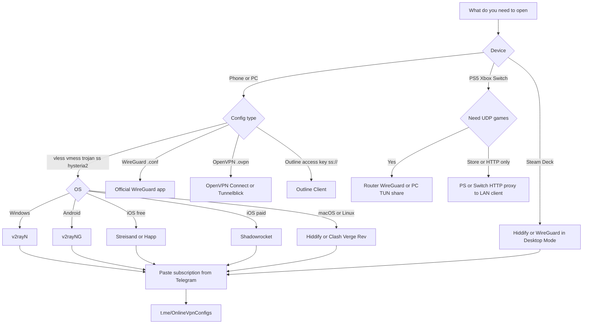

# Awesome VPN Clients

[](https://awesome.re)
[](https://unlicense.org/)
[](https://t.me/OnlineVpnConfigs)

Comparison of VPN and proxy **clients**: platforms, protocols, price, official downloads, TUN, subscriptions, QR import.

This repo is the app list. It does not ship servers or `vless://` strings. Fresh public configs are on [Telegram @OnlineVpnConfigs](https://t.me/OnlineVpnConfigs). Daily GitHub snapshot: [top-free-vpn-proxy-list](https://github.com/freeVpnMan/top-free-vpn-proxy-list).

## Table of contents

- [What this list is](#what-this-list-is)
- [Get live configs](#get-live-configs)
- [Pick a client in 30 seconds](#pick-a-client-in-30-seconds)
- [Master comparison](#master-comparison)
- [Protocol support](#protocol-support)
- [Features](#features)
- [Best VPN client by platform](#best-vpn-client-by-platform)
  - [Windows](#windows)
  - [Android](#android)
  - [iOS and iPadOS](#ios-and-ipados)
  - [macOS](#macos)
  - [Linux](#linux)
  - [Android TV](#android-tv)
- [Gaming consoles](#gaming-consoles)
  - [What the console can do](#what-the-console-can-do)
  - [Method 1: VPN on the router](#method-1-vpn-on-the-router)
  - [Method 2: Share from a PC](#method-2-share-from-a-pc)
  - [Method 3: HTTP proxy on PS or Switch](#method-3-http-proxy-on-ps-or-switch)
  - [Steam Deck](#steam-deck)
  - [NAT, ping, and game rules](#nat-ping-and-game-rules)
- [How to import a config](#how-to-import-a-config)
- [Self-hosted VPN clients](#self-hosted-vpn-clients)
- [Commercial privacy VPN apps](#commercial-privacy-vpn-apps)
- [Cores and config formats](#cores-and-config-formats)
- [Protocol glossary](#protocol-glossary)
- [Do not install these](#do-not-install-these)
- [Related projects](#related-projects)
- [FAQ](#faq)
- [Contributing](#contributing)
- [Disclaimer](#disclaimer)
- [License](#license)
- [Topics](#topics)
- [Machine-readable catalog](#machine-readable-catalog)

## What this list is

| This repo                                                 | Not this repo                                  |
| --------------------------------------------------------- | ---------------------------------------------- |
| Client apps you install on a device                       | Proxy servers, IPs, or ports                   |
| Official GitHub, App Store, Google Play, and vendor links | Random APK sites and Telegram "mod" builds     |
| Protocol, platform, price, and feature charts             | Cracked iOS apps or payment bypass             |
| How to import a subscription you already have             | A dump of live `vless://` / `vmess://` strings |

## Get live configs

The tables tell you which app to install. They do not include working servers. For a public VLESS / VMess / Trojan / Shadowsocks URI to test with, use [@OnlineVpnConfigs](https://t.me/OnlineVpnConfigs). Those nodes are shared by strangers. Skip them for banking and work mail. See [Disclaimer](#disclaimer). The daily GitHub table is [top-free-vpn-proxy-list](https://github.com/freeVpnMan/top-free-vpn-proxy-list).

## Pick a client in 30 seconds

| If you are on                          | Start with                                                                                                                           | Backup                                                                                                                                       | Why                                                                                                                                                                               |
| -------------------------------------- | ------------------------------------------------------------------------------------------------------------------------------------ | -------------------------------------------------------------------------------------------------------------------------------------------- | --------------------------------------------------------------------------------------------------------------------------------------------------------------------------------- |
| **Windows**                            | [v2rayN](https://github.com/2dust/v2rayN/releases)                                                                                   | [Clash Verge Rev](https://github.com/clash-verge-rev/clash-verge-rev/releases) or [Hiddify](https://github.com/hiddify/hiddify-app/releases) | v2rayN is the default Xray/sing-box GUI. Clash Verge Rev is the Clash YAML GUI. Hiddify is the simplest multi-OS app.                                                             |
| **Android**                            | [v2rayNG](https://github.com/2dust/v2rayNG/releases)                                                                                 | [Hiddify](https://github.com/hiddify/hiddify-app/releases) or [NekoBox](https://github.com/MatsuriDayo/NekoBoxForAndroid/releases)           | v2rayNG is the common import target. Hiddify is easier. NekoBox is sing-box with more knobs.                                                                                      |
| **iOS / iPadOS (free)**                | [Streisand](https://github.com/MatsuriDayo/Streisand) or [Happ](https://apps.apple.com/us/app/happ-proxy-utility/id6504287215)       | [Hiddify](https://github.com/hiddify/hiddify-app) / [V2Box](https://apps.apple.com/app/v2box-v2ray-client/id6446814690)                      | No App Store fee. Happ also covers Android, desktop, and TV.                                                                                                                      |
| **iOS (paid, most protocol coverage)** | [Shadowrocket](https://apps.apple.com/app/shadowrocket/id932747118)                                                                  | [Stash](https://apps.apple.com/app/stash-rule-based-proxy/id1596063349)                                                                      | One-time App Store purchase. Buy it from Apple, not from a "free IPA" site.                                                                                                       |
| **macOS**                              | [Hiddify](https://github.com/hiddify/hiddify-app/releases)                                                                           | [Clash Verge Rev](https://github.com/clash-verge-rev/clash-verge-rev/releases) or [v2rayN](https://github.com/2dust/v2rayN/releases)         | Same apps as Windows, plus Happ from the Mac App Store.                                                                                                                           |
| **Linux**                              | [v2rayN](https://github.com/2dust/v2rayN/releases) or [Clash Verge Rev](https://github.com/clash-verge-rev/clash-verge-rev/releases) | [v2rayA](https://github.com/v2rayA/v2rayA/releases) or [Throne](https://github.com/throneproj/Throne/releases)                               | v2rayA is a local web UI. Throne is the Qt desktop GUI (formerly Nekoray).                                                                                                        |
| **Android TV**                         | [Happ](https://play.google.com/store/apps/details?id=com.happproxy)                                                                  | [v2rayNG](https://github.com/2dust/v2rayNG/releases)                                                                                         | Happ has a TV build. v2rayNG can import from a QR image.                                                                                                                          |
| **Steam Deck**                         | [Hiddify](https://github.com/hiddify/hiddify-app/releases) (Desktop Mode)                                                            | Official [WireGuard](https://www.wireguard.com/install/) in KDE Network                                                                      | SteamOS is Linux. You can install a real client. See [Steam Deck](#steam-deck).                                                                                                   |
| **PS5 / PS4 / Switch / Xbox**          | Router WireGuard (GL.iNet / OpenWrt)                                                                                                 | PC share with [v2rayN](https://github.com/2dust/v2rayN) or [Clash Verge Rev](https://github.com/clash-verge-rev/clash-verge-rev) TUN         | No V2Ray app on the console. HTTP proxy on PS/Switch is store-only. See [Gaming consoles](#gaming-consoles).                                                                      |
| **You want WireGuard / OpenVPN only**  | [WireGuard](https://www.wireguard.com/install/) or [OpenVPN Connect](https://openvpn.net/client/)                                    | [Tunnelblick](https://tunnelblick.net/) (macOS OpenVPN)                                                                                      | Different world from VLESS/VMess. Use these with a server you run ([Algo](https://github.com/trailofbits/algo), [openvpn-install](https://github.com/angristan/openvpn-install)). |



## Master comparison

Legend: **OSS** = source on GitHub. **Closed** = binary only. **Free** = no app fee. **Paid** = App Store / vendor charge for the app itself (not a VPN plan).

| Client                     | Platforms                               | Core                         | Price               | Open source | Official link                                                               | Best for                              |
| -------------------------- | --------------------------------------- | ---------------------------- | ------------------- | ----------- | --------------------------------------------------------------------------- | ------------------------------------- |
| **v2rayN**                 | Windows, macOS, Linux                   | Xray, sing-box, mihomo       | Free                | OSS         | [GitHub](https://github.com/2dust/v2rayN)                                   | Default desktop V2Ray/Xray GUI        |
| **v2rayNG**                | Android                                 | Xray, v2fly                  | Free                | OSS         | [GitHub](https://github.com/2dust/v2rayNG)                                  | Default Android import target         |
| **Hiddify**                | Windows, macOS, Linux, Android, iOS     | sing-box                     | Free                | OSS         | [GitHub](https://github.com/hiddify/hiddify-app)                            | One app on every OS, low friction     |
| **Clash Verge Rev**        | Windows, macOS, Linux                   | mihomo                       | Free                | OSS         | [GitHub](https://github.com/clash-verge-rev/clash-verge-rev)                | Clash YAML, TUN, modern desktop UI    |
| **Clash Party**            | Windows, macOS, Linux                   | mihomo                       | Free                | OSS         | [GitHub](https://github.com/mihomo-party-org/clash-party)                   | Mihomo GUI, Smart core, Sub-Store     |
| **FlClash**                | Windows, macOS, Linux, Android          | mihomo                       | Free                | OSS         | [GitHub](https://github.com/chen08209/FlClash)                              | Flutter Clash UI, WebDAV sync         |
| **Karing**                 | Windows, Linux, Android                 | sing-box                     | Free                | OSS         | [GitHub](https://github.com/KaringX/karing)                                 | Clash-style rules on sing-box         |
| **Throne**                 | Windows, macOS, Linux                   | sing-box, Xray               | Free                | OSS         | [GitHub](https://github.com/throneproj/Throne)                              | Power-user desktop (ex Nekoray)       |
| **NekoBox**                | Android                                 | sing-box                     | Free                | OSS         | [GitHub](https://github.com/MatsuriDayo/NekoBoxForAndroid)                  | Android sing-box with plugins         |
| **sing-box**               | Windows, macOS, Linux, Android, iOS     | sing-box                     | Free                | OSS         | [GitHub](https://github.com/SagerNet/sing-box)                              | Engine + official mobile/desktop apps |
| **Happ**                   | Windows, macOS, Linux, iOS, Android, TV | Xray                         | Free                | Closed      | [happ.su](https://www.happ.su/main)                                         | Encrypted/hidden subscriptions, TV    |
| **Streisand**              | iOS                                     | Xray / related               | Free                | OSS         | [GitHub](https://github.com/MatsuriDayo/Streisand)                          | Free iOS V2Ray-class client           |
| **V2Box**                  | iOS, iPadOS                             | V2Ray-class                  | Free                | Closed      | [App Store](https://apps.apple.com/app/v2box-v2ray-client/id6446814690)     | Simple iOS subscription import        |
| **v2RayTun**               | Android, iOS                            | Xray                         | Free                | Closed      | Stores / vendor site                                                        | Simple mobile Xray client             |
| **Shadowrocket**           | iOS, iPadOS                             | Multi                        | Paid (~$2.99–$3.99) | Closed      | [App Store](https://apps.apple.com/app/shadowrocket/id932747118)            | Paid iOS standard                     |
| **Stash**                  | iOS, macOS                              | Clash-class                  | Paid                | Closed      | [App Store](https://apps.apple.com/app/stash-rule-based-proxy/id1596063349) | Clash rules on Apple                  |
| **Loon**                   | iOS                                     | Multi                        | Paid                | Closed      | [App Store](https://apps.apple.com/app/loon/id1373567447)                   | Scriptable Apple proxy                |
| **Quantumult X**           | iOS                                     | Multi                        | Paid                | Closed      | [App Store](https://apps.apple.com/app/quantumult-x/id1443988620)           | Rewrite/filter rules                  |
| **Surge**                  | iOS, macOS                              | Multi                        | Paid                | Closed      | [App Store](https://apps.apple.com/app/surge-5/id1442620678)                | Highest-end Apple network tool        |
| **Clash Meta for Android** | Android                                 | mihomo                       | Free                | OSS         | [GitHub](https://github.com/MetaCubeX/ClashMetaForAndroid)                  | Clash YAML on Android                 |
| **Surfboard**              | Android                                 | Clash-class                  | Free                | OSS         | [GitHub](https://github.com/getsurfboard/surfboard)                         | Lightweight Android Clash profile     |
| **v2rayA**                 | Linux, Windows, macOS, Docker           | V2Ray/Xray                   | Free                | OSS         | [GitHub](https://github.com/v2rayA/v2rayA)                                  | Browser UI, good on servers/NAS       |
| **Koala Clash**            | Windows, macOS, Linux                   | mihomo                       | Free                | OSS         | [GitHub](https://github.com/coolcoala/koala-clash)                          | Mihomo GUI, TUN without service mode  |
| **Prizrak-Box**            | Windows, macOS, Linux                   | mihomo                       | Free                | OSS         | [GitHub](https://github.com/legiz-ru/Prizrak-Box)                           | Light Mihomo desktop GUI              |
| **ClashX.Meta**            | macOS                                   | mihomo                       | Free                | OSS         | [GitHub](https://github.com/MetaCubeX/ClashX.Meta)                          | Native macOS menu-bar Clash           |
| **WireGuard**              | Windows, macOS, Linux, Android, iOS     | WireGuard                    | Free                | OSS         | [wireguard.com](https://www.wireguard.com/install/)                         | Official WG .conf / QR                |
| **OpenVPN Connect**        | Windows, macOS, Linux, Android, iOS     | OpenVPN                      | Free                | Vendor      | [openvpn.net](https://openvpn.net/client/)                                  | Official .ovpn client                 |
| **OpenVPN for Android**    | Android                                 | OpenVPN                      | Free                | OSS         | [GitHub](https://github.com/schwabe/ics-openvpn)                            | ICS OpenVPN, FOSS Android             |
| **Tunnelblick**            | macOS                                   | OpenVPN                      | Free                | OSS         | [tunnelblick.net](https://tunnelblick.net/)                                 | macOS OpenVPN GUI                     |
| **Outline Client**         | Windows, macOS, Linux, Android, iOS     | Shadowsocks                  | Free                | OSS         | [getoutline.org](https://getoutline.org/)                                   | Jigsaw Outline access keys            |
| **Amnezia VPN**            | Windows, macOS, Linux, Android, iOS     | WG, OpenVPN, Xray, AmneziaWG | Free app            | OSS         | [GitHub](https://github.com/amnezia-vpn/amnezia-client)                     | Self-host on your VPS from the app    |

GitHub star counts change. Use the shields on each project page. As of August 2026, v2rayN and Clash Verge Rev are the two largest desktop GUIs in this class.

## Protocol support

Values are typical current support in stable builds. Cores and plugins change. Check the project's README before you need an odd transport (xHTTP, AnyTLS, Naive, Juicity).

| Client                 | VLESS | VMess   | Trojan  | Shadowsocks | Hysteria2 | TUIC    | Reality | WireGuard | OpenVPN |
| ---------------------- | ----- | ------- | ------- | ----------- | --------- | ------- | ------- | --------- | ------- |
| v2rayN                 | Yes   | Yes     | Yes     | Yes         | Yes       | Yes     | Yes     | Yes       | No      |
| v2rayNG                | Yes   | Yes     | Yes     | Yes         | Yes       | Limited | Yes     | Limited   | No      |
| Hiddify                | Yes   | Yes     | Yes     | Yes         | Yes       | Yes     | Yes     | Yes       | No      |
| Clash Verge Rev        | Yes   | Yes     | Yes     | Yes         | Yes       | Yes     | Yes     | Yes       | No      |
| Clash Party            | Yes   | Yes     | Yes     | Yes         | Yes       | Yes     | Yes     | Yes       | No      |
| FlClash                | Yes   | Yes     | Yes     | Yes         | Yes       | Yes     | Yes     | Yes       | No      |
| Karing                 | Yes   | Yes     | Yes     | Yes         | Yes       | Yes     | Yes     | Yes       | No      |
| Throne                 | Yes   | Yes     | Yes     | Yes         | Yes       | Yes     | Yes     | Yes       | No      |
| NekoBox                | Yes   | Yes     | Yes     | Yes         | Yes       | Yes     | Yes     | Yes       | No      |
| sing-box app           | Yes   | Yes     | Yes     | Yes         | Yes       | Yes     | Yes     | Yes       | No      |
| Happ                   | Yes   | Yes     | Yes     | Yes         | Yes       | Limited | Yes     | Limited   | No      |
| Streisand              | Yes   | Yes     | Yes     | Yes         | Yes       | Limited | Yes     | Limited   | No      |
| V2Box                  | Yes   | Yes     | Yes     | Yes         | Limited   | Limited | Yes     | No        | No      |
| Shadowrocket           | Yes   | Yes     | Yes     | Yes         | Yes       | Yes     | Yes     | Yes       | No      |
| Stash                  | Yes   | Yes     | Yes     | Yes         | Yes       | Yes     | Yes     | Yes       | No      |
| Clash Meta for Android | Yes   | Yes     | Yes     | Yes         | Yes       | Yes     | Yes     | Yes       | No      |
| WireGuard official     | No    | No      | No      | No          | No        | No      | No      | Yes       | No      |
| OpenVPN Connect        | No    | No      | No      | No          | No        | No      | No      | No        | Yes     |
| Outline Client         | No    | No      | No      | Yes         | No        | No      | No      | No        | No      |
| Amnezia VPN            | Yes   | Limited | Limited | Yes         | Limited   | No      | Yes     | Yes       | Yes     |

"Limited" means support exists in some builds, via a plugin, or only for a subset of parameters. Treat it as "verify in the app", not as a guarantee.

## Features

| Client          | Subscription URL | QR import | TUN / system-wide | Rule routing          | Split tunnel      | Auto node pick    | Notes                            |
| --------------- | ---------------- | --------- | ----------------- | --------------------- | ----------------- | ----------------- | -------------------------------- |
| v2rayN          | Yes              | Yes       | Yes               | Yes                   | Yes               | Latency test      | Multi-core switch                |
| v2rayNG         | Yes              | Yes       | VPN service       | Yes                   | Per-app           | Latency test      | Most documented Android path     |
| Hiddify         | Yes              | Yes       | Yes               | Region presets        | Yes               | Yes               | Clash / V2Ray / sing-box input   |
| Clash Verge Rev | Yes              | Yes       | Yes               | Clash YAML            | Yes               | Groups / fallback | Theme, WebDAV, merge scripts     |
| Clash Party     | Yes              | Yes       | Yes               | Override + Smart core | Yes               | AI/smart core     | Sub-Store integration            |
| FlClash         | Yes              | Yes       | Yes               | Clash YAML            | Yes               | Groups            | Material You, WebDAV             |
| Karing          | Yes              | Yes       | Yes               | Clash + ACL rulesets  | Yes               | Yes               | Beginner mode                    |
| Throne          | Yes              | Yes       | Yes               | Yes                   | Yes               | Latency test      | Extra core, chaining             |
| NekoBox         | Yes              | Yes       | Yes               | Outbound-focused      | Per-app           | Yes               | Plugins: Naive, Mieru, Trojan-Go |
| Happ            | Yes              | Yes       | Yes               | Yes                   | Per-app (desktop) | Yes               | Encrypted and hidden subs        |
| Streisand       | Yes              | Yes       | Yes               | Basic                 | Limited           | Yes               | Free App Store class             |
| Shadowrocket    | Yes              | Yes       | Yes               | Yes                   | Yes               | Yes               | MITM/rewrite (you own the risk)  |
| sing-box        | Profile JSON     | Yes       | Yes               | Full sing-box         | Yes               | Selectors         | Least GUI, most control          |
| WireGuard       | No (file/QR)     | Yes       | Yes               | AllowedIPs            | AllowedIPs        | No                | Keys in the conf file            |
| OpenVPN Connect | No (.ovpn)       | Limited   | Yes               | Limited               | Limited           | No                | TCP helps on strict networks     |
| Outline         | Access key       | Yes       | Yes               | No                    | No                | No                | One key, one server              |
| Amnezia         | Self-host wizard | Yes       | Yes               | Split / app           | Yes               | Protocol picker   | Deploys Docker on your VPS       |

## Best VPN client by platform

### Windows

| Rank | Client          | Get it                                                                                                        | Extra                                |
| ---- | --------------- | ------------------------------------------------------------------------------------------------------------- | ------------------------------------ |
| 1    | v2rayN          | [Releases](https://github.com/2dust/v2rayN/releases)                                                          | Switch cores: Xray, sing-box, mihomo |
| 2    | Clash Verge Rev | [Releases](https://github.com/clash-verge-rev/clash-verge-rev/releases)                                       | Tauri UI, TUN, Clash profiles        |
| 3    | Hiddify         | [Releases](https://github.com/hiddify/hiddify-app/releases)                                                   | Same project as mobile               |
| 4    | Happ            | [happ.su](https://www.happ.su/main) / [desktop releases](https://github.com/Happ-proxy/happ-desktop/releases) | Closed source, easy import           |
| 5    | Throne          | [Releases](https://github.com/throneproj/Throne/releases)                                                     | Replaces Nekoray                     |
| 6    | Clash Party     | [clashparty.org](https://clashparty.org) / [GitHub](https://github.com/mihomo-party-org/clash-party)          | Smart core                           |
| 7    | FlClash         | [Releases](https://github.com/chen08209/FlClash/releases)                                                     | Also Android                         |
| 8    | Karing          | [karing.app](https://karing.app) / [GitHub](https://github.com/KaringX/karing)                                | Clash rules + sing-box               |
| 9    | WireGuard       | [download.wireguard.com](https://download.wireguard.com/windows-client/)                                      | WG only                              |
| 10   | OpenVPN Connect | [openvpn.net](https://openvpn.net/client/)                                                                    | .ovpn only                           |

Need Visual C++ runtimes if a Qt or C++ GUI fails to start. Download runtimes from Microsoft, not from a "DLL pack" site.

### Android

| Rank | Client                 | Get it                                                                                                                           | Extra                                   |
| ---- | ---------------------- | -------------------------------------------------------------------------------------------------------------------------------- | --------------------------------------- |
| 1    | v2rayNG                | [GitHub](https://github.com/2dust/v2rayNG/releases)                                                                              | Play/GitHub; most tutorials assume this |
| 2    | Hiddify                | [GitHub](https://github.com/hiddify/hiddify-app/releases)                                                                        | Auto select, region routing             |
| 3    | NekoBox                | [GitHub](https://github.com/MatsuriDayo/NekoBoxForAndroid/releases)                                                              | sing-box + plugins                      |
| 4    | Happ                   | [Play](https://play.google.com/store/apps/details?id=com.happproxy) / [APK](https://github.com/Happ-proxy/happ-android/releases) | Encrypted subscriptions                 |
| 5    | Clash Meta for Android | [GitHub](https://github.com/MetaCubeX/ClashMetaForAndroid)                                                                       | Clash YAML                              |
| 6    | FlClash                | [GitHub](https://github.com/chen08209/FlClash/releases)                                                                          | Same UI as desktop                      |
| 7    | Karing                 | [GitHub](https://github.com/KaringX/karing/releases)                                                                             | Rulesets                                |
| 8    | sing-box               | [GitHub](https://github.com/SagerNet/sing-box-for-android)                                                                       | Official engine app                     |
| 9    | Surfboard              | [GitHub](https://github.com/getsurfboard/surfboard)                                                                              | Clash profile                           |
| 10   | Outline                | [Play](https://play.google.com/store/apps/details?id=org.outline.android.client)                                                 | Shadowsocks / Outline keys              |
| 11   | WireGuard              | [Play](https://play.google.com/store/apps/details?id=com.wireguard.android)                                                      | WG only                                 |
| 12   | OpenVPN for Android    | [GitHub](https://github.com/schwabe/ics-openvpn)                                                                                 | FOSS .ovpn                              |
| 13   | Amnezia                | [amnezia.org](https://amnezia.org)                                                                                               | Self-host stack                         |

Prefer GitHub Releases or Google Play. Avoid third-party APK mirrors.

### iOS and iPadOS

Apple does not allow arbitrary sideloading in the same way Android does. Use the App Store or TestFlight from the vendor.

| Client          | Price | Get it                                                                      | Extra                              |
| --------------- | ----- | --------------------------------------------------------------------------- | ---------------------------------- |
| Streisand       | Free  | App Store / [GitHub](https://github.com/MatsuriDayo/Streisand)              | Best-known free V2Ray-class option |
| Happ            | Free  | [App Store](https://apps.apple.com/us/app/happ-proxy-utility/id6504287215)  | Also Mac and TV                    |
| Hiddify         | Free  | [GitHub](https://github.com/hiddify/hiddify-app) / TestFlight when offered  | Cross-platform                     |
| V2Box           | Free  | [App Store](https://apps.apple.com/app/v2box-v2ray-client/id6446814690)     | Used in many import guides         |
| sing-box        | Free  | [GitHub](https://github.com/SagerNet/sing-box-for-apple)                    | Official Apple port                |
| WireGuard       | Free  | [App Store](https://apps.apple.com/app/wireguard/id1441195209)              | WG only                            |
| OpenVPN Connect | Free  | [App Store](https://apps.apple.com/app/openvpn-connect/id590379981)         | .ovpn                              |
| Outline         | Free  | [App Store](https://apps.apple.com/app/outline-app/id1356177741)            | Outline keys                       |
| Amnezia         | Free  | [App Store](https://apps.apple.com/app/amnezia-vpn/id1600529900)            | Self-host                          |
| Shadowrocket    | Paid  | [App Store](https://apps.apple.com/app/shadowrocket/id932747118)            | Do not pirate this                 |
| Stash           | Paid  | [App Store](https://apps.apple.com/app/stash-rule-based-proxy/id1596063349) | Clash-like                         |
| Loon            | Paid  | [App Store](https://apps.apple.com/app/loon/id1373567447)                   | Scripts                            |
| Quantumult X    | Paid  | [App Store](https://apps.apple.com/app/quantumult-x/id1443988620)           | Rewrite                            |
| Surge 5         | Paid  | [App Store](https://apps.apple.com/app/surge-5/id1442620678)                | Desktop-class on iOS               |

This list will not tell you how to skip an App Store payment. That is theft of the developer's work and it will get a GitHub repo removed.

### macOS

| Client          | Get it                                                                                                                                  | Extra                   |
| --------------- | --------------------------------------------------------------------------------------------------------------------------------------- | ----------------------- |
| Hiddify         | [Releases](https://github.com/hiddify/hiddify-app/releases)                                                                             | Intel and Apple silicon |
| Clash Verge Rev | [Releases](https://github.com/clash-verge-rev/clash-verge-rev/releases)                                                                 | `.dmg` aarch64 and x64  |
| v2rayN          | [Releases](https://github.com/2dust/v2rayN/releases)                                                                                    | Same as Windows         |
| Happ            | [App Store](https://apps.apple.com/us/app/happ-proxy-utility/id6504287215) / [dmg](https://github.com/Happ-proxy/happ-desktop/releases) | Closed source           |
| ClashX.Meta     | [GitHub](https://github.com/MetaCubeX/ClashX.Meta)                                                                                      | Menu bar                |
| Throne          | [Releases](https://github.com/throneproj/Throne/releases)                                                                               | Qt                      |
| Clash Party     | [GitHub](https://github.com/mihomo-party-org/clash-party)                                                                               | Electron                |
| FlClash         | [GitHub](https://github.com/chen08209/FlClash)                                                                                          | Flutter                 |
| Tunnelblick     | [tunnelblick.net](https://tunnelblick.net/)                                                                                             | OpenVPN                 |
| WireGuard       | Mac App Store                                                                                                                           | Official                |
| Outline         | [getoutline.org](https://getoutline.org/)                                                                                               | SS / Outline            |

### Linux

| Client          | Get it                                                                                                | Extra                                    |
| --------------- | ----------------------------------------------------------------------------------------------------- | ---------------------------------------- |
| v2rayN          | [Releases](https://github.com/2dust/v2rayN/releases)                                                  | Desktop GUI                              |
| Clash Verge Rev | `.deb` / `.rpm` / AppImage on [Releases](https://github.com/clash-verge-rev/clash-verge-rev/releases) | x64 and arm64                            |
| v2rayA          | [GitHub](https://github.com/v2rayA/v2rayA)                                                            | Web UI on `127.0.0.1`                    |
| Hiddify         | [Releases](https://github.com/hiddify/hiddify-app/releases)                                           | Flutter                                  |
| Throne          | [Releases](https://github.com/throneproj/Throne/releases)                                             | Qt, TUN                                  |
| Karing          | [GitHub](https://github.com/KaringX/karing/releases)                                                  | glibc version matters                    |
| FlClash         | [GitHub](https://github.com/chen08209/FlClash/releases)                                               | Flutter                                  |
| sing-box        | [GitHub](https://github.com/SagerNet/sing-box/releases)                                               | CLI + service                            |
| mihomo          | [GitHub](https://github.com/MetaCubeX/mihomo)                                                         | Clash Meta core, pair with a GUI or REST |
| WireGuard       | distro package `wireguard-tools`                                                                      | `wg-quick`                               |
| OpenVPN         | distro package `openvpn`                                                                              | Official APT repo on Debian/Ubuntu       |
| Outline         | [getoutline.org](https://getoutline.org/)                                                             | Electron                                 |

### Android TV

| Client    | Get it                                                              | Extra                     |
| --------- | ------------------------------------------------------------------- | ------------------------- |
| Happ      | [Play](https://play.google.com/store/apps/details?id=com.happproxy) | Built for TV remote       |
| v2rayNG   | [GitHub](https://github.com/2dust/v2rayNG/releases)                 | Import from QR screenshot |
| WireGuard | Play / sideload official                                            | If you have a WG peer     |

Generate a QR from your subscription on a phone, then scan it on the TV app. Do not photograph configs that include private keys and then post them publicly.

## Gaming consoles

PlayStation, Xbox, and Nintendo Switch **cannot install** v2rayN, v2rayNG, Hiddify, Clash, or Shadowrocket. There is no sideload store for those OS kernels that this list will document. You put the tunnel on a **router** or a **PC**, then the console uses ordinary Wi-Fi or Ethernet.

Steam Deck is the exception: it runs SteamOS (Linux). Install a real client there.

Public Telegram nodes are a bad idea for ranked play: shared bandwidth, unstable UDP, and high ping. For games, use a **WireGuard** or **OpenVPN** server you control ([Algo](https://github.com/trailofbits/algo), [openvpn-install](https://github.com/angristan/openvpn-install), [Amnezia](https://github.com/amnezia-vpn/amnezia-client)), or a paid VPN that publishes a router profile. Use [Telegram @OnlineVpnConfigs](https://t.me/OnlineVpnConfigs) only to test that Method 3 (HTTP proxy) even connects.

### What the console can do

| Console                           | Native VPN / V2Ray app | Built-in proxy      | Covers game UDP             | Practical path                                                                                                                                                                    |
| --------------------------------- | ---------------------- | ------------------- | --------------------------- | --------------------------------------------------------------------------------------------------------------------------------------------------------------------------------- |
| **PS5 / PS4**                     | No                     | HTTP/HTTPS only     | No (proxy is HTTP)          | Router tunnel, or PC share. HTTP proxy for PSN store / some web only.                                                                                                             |
| **Xbox Series X/S / Xbox One**    | No                     | None                | Only via router or PC       | Router or PC share. No proxy field in the OS.                                                                                                                                     |
| **Nintendo Switch / OLED / Lite** | No                     | HTTP/HTTPS only     | No (proxy is HTTP)          | Router tunnel, or PC share. HTTP proxy for eShop / some Nintendo HTTP only.                                                                                                       |
| **Steam Deck**                    | Yes                    | Not needed          | Yes, if the client does TUN | [Hiddify](https://github.com/hiddify/hiddify-app/releases), [Clash Verge Rev](https://github.com/clash-verge-rev/clash-verge-rev/releases), or official WireGuard in Desktop Mode |
| **NVIDIA Shield / Google TV**     | Yes                    | Not needed          | Yes                         | [Happ](https://play.google.com/store/apps/details?id=com.happproxy) or [v2rayNG](https://github.com/2dust/v2rayNG/releases)                                                       |
| **Apple TV**                      | Almost none            | Limited             | Router is the real option   | Happ lists tvOS on [happ.su](https://www.happ.su/main). Otherwise treat it like a console: router.                                                                                |
| **Meta Quest**                    | Store is locked down   | No useful V2Ray app | Router                      | Same as Xbox: tunnel at the AP, not on the headset                                                                                                                                |

HTTP/HTTPS proxy on PS and Switch is **not** a VPN. Multiplayer, voice chat, and most matchmaking use UDP. That traffic ignores the console proxy box.

### Method 1: VPN on the router

Best option for every living-room console. The console stays dumb: DHCP, no proxy toggle.

| Hardware                                                          | Why it is used                               | Protocols you can run                                               | Link                                                                                                                                                                            |
| ----------------------------------------------------------------- | -------------------------------------------- | ------------------------------------------------------------------- | ------------------------------------------------------------------------------------------------------------------------------------------------------------------------------- |
| **GL.iNet** travel / home routers                                 | Vendor GUI for WireGuard and OpenVPN clients | WireGuard, OpenVPN, some SS                                         | [gl-inet.com](https://www.gl-inet.com/)                                                                                                                                         |
| **OpenWrt** on a supported box                                    | Full control, policy routing by MAC          | WireGuard, OpenVPN, sing-box, mihomo (OpenClash / similar packages) | [openwrt.org](https://openwrt.org/)                                                                                                                                             |
| **ASUS Merlin**                                                   | Stock-like UI plus VPN client                | WireGuard, OpenVPN                                                  | [asuswrt-merlin.net](https://www.asuswrt-merlin.net/)                                                                                                                           |
| **Amnezia / Algo / Outline on a VPS**, then WG/OVPN on the router | You own the exit                             | Whatever the installer built                                        | [amnezia-client](https://github.com/amnezia-vpn/amnezia-client), [algo](https://github.com/trailofbits/algo), [outline-apps](https://github.com/OutlineFoundation/outline-apps) |

Guidance:

1. Prefer **WireGuard** over OpenVPN UDP/TCP for ping. Use OpenVPN **TCP** only if UDP is blocked on the path to the VPS.
2. Give the console a **DHCP reservation** (static LAN IP) so policy routing always hits the same device.
3. Route **only the console** through the tunnel if you can. Phones and TVs do not need the extra hop.
4. Leave the console proxy **Off**. The router already wraps packets.
5. After connect, reboot the console, then run the built-in network test (PS5: Settings → Network → Test Internet Connection. Xbox: Settings → Network → Test NAT type).
6. If you need VLESS/Reality on the WAN, that runs **on OpenWrt / sing-box / mihomo**, not inside the PS5 menu. The console still sees a normal gateway.

Do not flash random "VPN firmware" from a file-sharing site. Use the vendor image or OpenWrt for your exact board.

### Method 2: Share from a PC

Use this when you cannot touch the ISP router. A **wired** PC-to-console link beats Wi-Fi-to-Wi-Fi.

| Step | What to do                                                                                                                                                                                  |
| ---- | ------------------------------------------------------------------------------------------------------------------------------------------------------------------------------------------- |
| 1    | Install [v2rayN](https://github.com/2dust/v2rayN/releases) or [Clash Verge Rev](https://github.com/clash-verge-rev/clash-verge-rev/releases) on Windows, or Hiddify / Clash Verge on Linux. |
| 2    | Import a **stable** config (your VPS or a paid plan). Skip crowded public lists for games.                                                                                                  |
| 3    | Turn on **TUN** (virtual NIC). System proxy alone will not carry Xbox or most game UDP.                                                                                                     |
| 4    | Allow LAN / "share over hotspot" in the client if you use Wi-Fi sharing.                                                                                                                    |
| 5    | Plug Ethernet from the PC to the console, or enable Windows **Mobile hotspot** / **Internet Connection Sharing** from the TUN adapter to the Ethernet port.                                 |
| 6    | Console: automatic IP (DHCP). Proxy **Off**.                                                                                                                                                |

Windows notes:

- Sharing works more reliably when the VPN exposes a real adapter (TUN / TAP). If ICS has nothing to bind to, TUN is off or the core is in userspace-only proxy mode.
- Keep the PC awake. Sleep kills the tunnel and the console drops.
- Xbox is picky about NAT. After sharing, check NAT type. Strict NAT means party chat and some titles will fail. UPnP on the PC share path is often missing, so expect Moderate.

Phone hotspot is usually the **wrong** tool:

- iPhone Personal Hotspot does **not** send the Switch or PS5 through Shadowrocket / Happ on that phone.
- Many Android hotspots also leak tethered clients around the VPN. Do not assume "VPN on phone = VPN on console".

### Method 3: HTTP proxy on PS or Switch

Works for **some store and HTTP** traffic. Does **not** replace Method 1 or 2 for Call of Duty, Fortnite, Smash, or most P2P.

On the PC (same LAN as the console):

1. Run v2rayN, Clash Verge Rev, Hiddify, or Happ.
2. Enable **Allow LAN**.
3. Note the **mixed** or **HTTP** inbound port (often `7890`, `10809`, or whatever the app shows). Bind address must be the PC LAN IP, not only `127.0.0.1`.
4. Allow that TCP port in the Windows/macOS firewall for private networks.
5. Confirm the PC and console are on the same subnet (example: `192.168.1.x`). Guest Wi-Fi isolation will block this.

**PS5 / PS4**

1. Settings → Network → Settings → Set Up Internet Connection.
2. Choose Wi-Fi or LAN → **Custom**.
3. IP Address Settings: Automatic (unless you already use static).
4. DHCP Host Name: Do Not Specify.
5. DNS Settings: Automatic, or a resolver you trust.
6. **Proxy Server: Use**.
7. Address: LAN IP of the PC (example `192.168.1.10`). Port: the mixed/HTTP port.
8. Test Internet Connection.

**Nintendo Switch**

1. System Settings → Internet → Internet Settings → pick the network → Change Settings.
2. Proxy Settings → **On**.
3. Server: LAN IP of the PC. Port: mixed/HTTP port.
4. Leave user/password empty unless your inbound requires auth.
5. Save, then Test Connection.

**Xbox**

There is no proxy field. Stop here. Use Method 1 or 2.

If the test passes but a game still "needs an update" or cannot matchmake, that is expected: the game is not using HTTP.

### Steam Deck

Steam Deck is a Linux PC in a gamepad. Switch to **Desktop Mode**.

| Goal                                | Client                                                                                                                                       | Notes                                                               |
| ----------------------------------- | -------------------------------------------------------------------------------------------------------------------------------------------- | ------------------------------------------------------------------- |
| Lowest ping, your VPS               | WireGuard in KDE Network settings, or `wireguard-tools`                                                                                      | Import the `.conf` from Algo / Amnezia / your host                  |
| VLESS / VMess / Trojan / Clash YAML | [Hiddify](https://github.com/hiddify/hiddify-app/releases) or [Clash Verge Rev](https://github.com/clash-verge-rev/clash-verge-rev/releases) | Download the Linux build. Need a passworded `sudo` user to install. |
| Commercial no-logs                  | [Mullvad](https://mullvad.net/download/) or [Proton VPN](https://protonvpn.com/) Linux                                                       | Official Deck/Linux packages                                        |
| OpenVPN                             | Distro OpenVPN or vendor app                                                                                                                 | TCP if UDP is blocked                                               |

Return to Gaming Mode after the tunnel is up if you only play Steam. Some overlays need the VPN started in Desktop Mode first, then you switch back. If a title ignores the tunnel, enable TUN in Hiddify/Clash, not system-proxy-only.

Do not jailbreak the Deck for a "console VPN IPAs" pack. Official Linux clients exist.

### NAT, ping, and game rules

| Problem                      | What to do                                                                                                                                           |
| ---------------------------- | ---------------------------------------------------------------------------------------------------------------------------------------------------- |
| High ping                    | Closest exit to **you**, not to the game region you wish you were in. WireGuard. Skip public VLESS lists.                                            |
| Packet loss                  | Wired console. Avoid double Wi-Fi hops. Lower MTU on the tunnel (try 1280–1420) if sessions drop.                                                    |
| Xbox NAT Strict / Moderate   | Router UPnP or manual port forwards on **your** WG/OVPN server. Double NAT (ISP CGNAT + VPN) is a common cause.                                      |
| PS5 NAT Type 3               | Same as Xbox: the tunnel must allow inbound or UPnP-style mapping. A CGNAT VPS will stay Type 3.                                                     |
| Voice chat fails, game plays | UDP or NAT. Fix the tunnel, not the HTTP proxy box.                                                                                                  |
| Store works, game does not   | You used Method 3. Move to Method 1 or 2.                                                                                                            |
| Ban / ToS                    | Some publishers restrict VPNs. That is their rule, not this catalog's. Using a tunnel to evade a hardware/region ban can violate the game agreement. |
| Public node on Telegram      | Fine to see if a PS proxy test turns green. Do not take it into ranked queues.                                                                       |

Configs for a self-hosted WireGuard peer are files you generate on **your** server. They are not the Telegram VLESS list. For throwaway HTTP-proxy tests only, join [https://t.me/OnlineVpnConfigs](https://t.me/OnlineVpnConfigs) and import the sub on the **PC**, not on the console.

## How to import a config

Same idea on every serious client. Names of buttons differ.

1. Install a client from the tables above. Use the official link only.
2. Open [https://t.me/OnlineVpnConfigs](https://t.me/OnlineVpnConfigs) and copy a **subscription URL** or a single share link.
3. In the app, find **Subscription**, **Profile**, **Add from clipboard**, or **Import from URL**.
4. Paste, wait for the node list, then **Update**.
5. Run a **latency / ping test**. Sort. Connect to a live server.
6. If the browser still leaks, enable **TUN** (desktop) or the system **VPN permission** (mobile).

| Client            | Typical import path                                     |
| ----------------- | ------------------------------------------------------- |
| v2rayN            | Subscription → Subscription settings → Add URL → Update |
| v2rayNG           | + → Import from clipboard / URL → menu → Update         |
| Hiddify           | New profile → Add from clipboard                        |
| Clash Verge Rev   | Profiles → New → Remote URL                             |
| Happ              | Add subscription / clipboard                            |
| Streisand / V2Box | Config → + → Subscribe → paste URL                      |
| Shadowrocket      | + → Type: Subscribe → URL                               |
| sing-box          | Profiles → Remote profile                               |
| Throne            | Profiles → Add from clipboard                           |
| Outline           | Add server → paste `ss://` access key                   |
| WireGuard         | Import tunnel from file or QR                           |
| OpenVPN           | Import `.ovpn`                                          |

If import fails, the format may not match the core. Clash YAML belongs in a mihomo GUI. Base64 V2Ray lists belong in v2rayN / v2rayNG / Streisand / Happ. sing-box JSON belongs in sing-box or Hiddify. The Telegram channel posts formats that the common apps accept.

Need a config right now? **[Join the Telegram channel](https://t.me/OnlineVpnConfigs).**

## Self-hosted VPN clients

These apps talk to **your** server. They are the right choice for mail, banking, and work. They are a poor match for a random public VLESS list.

| Project             | Client role                       | Protocols                                  | Platforms | Price     | Link                                                    |
| ------------------- | --------------------------------- | ------------------------------------------ | --------- | --------- | ------------------------------------------------------- |
| **WireGuard**       | Official apps                     | WireGuard                                  | All major | Free      | [wireguard.com](https://www.wireguard.com/install/)     |
| **OpenVPN Connect** | Official apps                     | OpenVPN UDP/TCP                            | All major | Free      | [openvpn.net/client](https://openvpn.net/client/)       |
| **Tunnelblick**     | macOS OpenVPN GUI                 | OpenVPN                                    | macOS     | Free      | [tunnelblick.net](https://tunnelblick.net/)             |
| **Outline Client**  | Jigsaw client                     | Shadowsocks                                | All major | Free      | [getoutline.org](https://getoutline.org/)               |
| **Amnezia VPN**     | Client + one-click server install | AmneziaWG, WireGuard, OpenVPN, Cloak, Xray | All major | Free app  | [GitHub](https://github.com/amnezia-vpn/amnezia-client) |
| **SoftEther**       | Client + server                   | SoftEther, OpenVPN, L2TP, SSTP             | Desktop   | Free      | [softether.org](https://www.softether.org/)             |
| **Tailscale**       | Mesh overlay                      | WireGuard-based                            | All major | Free tier | [tailscale.com](https://tailscale.com/)                 |
| **NetBird**         | Mesh overlay                      | WireGuard-based                            | All major | Free tier | [netbird.io](https://netbird.io/)                       |

Server installers that pair with the clients above (not clients themselves):

| Installer       | What it builds                           | Link                                                                                |
| --------------- | ---------------------------------------- | ----------------------------------------------------------------------------------- |
| Algo VPN        | WireGuard + IKEv2 on a cloud VM          | [trailofbits/algo](https://github.com/trailofbits/algo)                             |
| openvpn-install | OpenVPN on Debian/Ubuntu/Fedora and more | [angristan/openvpn-install](https://github.com/angristan/openvpn-install)           |
| Outline Manager | Shadowsocks server you control           | [OutlineFoundation/outline-apps](https://github.com/OutlineFoundation/outline-apps) |
| Amnezia         | Docker stack on your VPS from the app    | [amnezia-vpn/amnezia-client](https://github.com/amnezia-vpn/amnezia-client)         |

Algo's own docs are clear: it is a personal VPN, not an anonymity system, and not a "bypass everything" product. That is the correct threat model for self-host too.

## Commercial privacy VPN apps

These apps **do not** import a Telegram VLESS list. They talk to a paid (or freemium) provider. Listed because people search "VPN client" and mean this.

| App        | Platforms                       | Typical protocols                     | Price model            | Open source client                                  | Link                                      |
| ---------- | ------------------------------- | ------------------------------------- | ---------------------- | --------------------------------------------------- | ----------------------------------------- |
| Mullvad    | Win, macOS, Linux, Android, iOS | WireGuard, OpenVPN, obfuscation modes | Paid, no account email | [GitHub](https://github.com/mullvad/mullvadvpn-app) | [mullvad.net](https://mullvad.net/)       |
| Proton VPN | Win, macOS, Linux, Android, iOS | WireGuard, OpenVPN, Stealth           | Free tier + paid       | [GitHub](https://github.com/ProtonVPN)              | [protonvpn.com](https://protonvpn.com/)   |
| IVPN       | Win, macOS, Linux, Android, iOS | WireGuard, OpenVPN                    | Paid                   | [GitHub](https://github.com/ivpn)                   | [ivpn.net](https://ivpn.net/)             |
| Windscribe | Win, macOS, Linux, Android, iOS | WG, OpenVPN, IKEv2                    | Free 10 GB + paid      | Partial                                             | [windscribe.com](https://windscribe.com/) |

A no-logs commercial VPN is still a company you trust with your traffic metadata. A public Telegram node is a stranger's server. Neither is magic.

## Cores and config formats

| Format                          | Typical file / URL                                       | Open with                                                            |
| ------------------------------- | -------------------------------------------------------- | -------------------------------------------------------------------- |
| V2Ray / Xray share links        | `vless://` `vmess://` `trojan://` `ss://` or Base64 list | v2rayN, v2rayNG, Happ, Streisand, Hiddify, Shadowrocket              |
| Clash YAML                      | `clash.yaml` subscription                                | Clash Verge Rev, Clash Party, FlClash, Clash Meta for Android, Stash |
| sing-box JSON                   | `config.json` / remote profile                           | sing-box, Hiddify, NekoBox, Throne, Karing                           |
| Outline key                     | `ss://` access key                                       | Outline Client (also many SS-capable apps)                           |
| WireGuard                       | `.conf` or QR                                            | Official WireGuard                                                   |
| OpenVPN                         | `.ovpn`                                                  | OpenVPN Connect, Tunnelblick, OpenVPN for Android                    |
| Console HTTP (PS / Switch only) | PC mixed/HTTP port on the LAN                            | Not a format. See [Method 3](#method-3-http-proxy-on-ps-or-switch)   |

| Core          | What it is                                      | Used by                                                  |
| ------------- | ----------------------------------------------- | -------------------------------------------------------- |
| **Xray**      | V2Ray-compatible core, Reality, many transports | v2rayN, v2rayNG, Happ, Amnezia (Xray mode)               |
| **sing-box**  | Universal proxy stack, Hysteria2, TUIC, WG      | Hiddify, NekoBox, Throne, Karing, official sing-box apps |
| **mihomo**    | Clash Meta fork, rule-based YAML                | Clash Verge Rev, Clash Party, FlClash, ClashX.Meta, CMFA |
| **WireGuard** | Kernel/userspace tunnel                         | Official apps, Algo, AmneziaWG (modified)                |
| **OpenVPN**   | TLS VPN, UDP or TCP                             | OpenVPN Connect, Tunnelblick                             |

## Protocol glossary

| Term                     | One-line meaning                                                                               | Client hint                                                          |
| ------------------------ | ---------------------------------------------------------------------------------------------- | -------------------------------------------------------------------- |
| **VLESS**                | Lightweight V2Ray protocol, often paired with TLS or Reality                                   | Any Xray / sing-box GUI                                              |
| **VMess**                | Older V2Ray protocol, still common in public lists                                             | v2rayN / v2rayNG                                                     |
| **Trojan**               | Looks like HTTPS to a TLS server                                                               | Most multi-protocol apps                                             |
| **Shadowsocks (SS)**     | Simple encrypted SOCKS-like proxy                                                              | Outline, Clash, Xray, sing-box                                       |
| **Reality**              | TLS fingerprint trick used with VLESS                                                          | Xray / sing-box clients                                              |
| **Hysteria2**            | QUIC-based, useful on lossy links                                                              | sing-box / mihomo / newer Xray GUIs                                  |
| **TUIC**                 | QUIC proxy                                                                                     | sing-box family                                                      |
| **WireGuard**            | Fast UDP tunnel, easy to fingerprint on some networks                                          | Official WG or AmneziaWG                                             |
| **AmneziaWG**            | WireGuard with junk headers / padding                                                          | Amnezia apps                                                         |
| **OpenVPN**              | Mature TLS VPN, TCP mode survives bad networks                                                 | OpenVPN clients                                                      |
| **IKEv2 / IPsec**        | Native on many phones                                                                          | Algo (Apple profile), Amnezia, commercial VPNs                       |
| **TUN**                  | Virtual NIC so apps that ignore system proxy still go through                                  | Desktop Clash / v2rayN / Hiddify; required if you share a PC to Xbox |
| **NAT type**             | How inbound game/voice sessions reach the console (Open / Moderate / Strict, or PS Type 1/2/3) | Router UPnP or a VPS that is not behind CGNAT                        |
| **HTTP proxy (console)** | PS5/Switch setting that only wraps HTTP/HTTPS                                                  | Store tests. Not matchmaking.                                        |
| **Subscription**         | HTTP(S) URL that returns a node list                                                           | Almost every V2Ray/Clash GUI                                         |

## Do not install these

| Thing                                                  | Why                                                                                      |
| ------------------------------------------------------ | ---------------------------------------------------------------------------------------- |
| **Clash for Windows (Fndroid)**                        | Abandoned. History of a supply-chain incident. Use Clash Verge Rev or Clash Party.       |
| **Random "v2ray pro" APKs**                            | Often adware or stealers. Use GitHub Releases or the store.                              |
| **Cracked Shadowrocket / Surge IPAs**                  | Stolen software plus a high chance of malware.                                           |
| **Qv2ray / original Clash for Android (unmaintained)** | Frozen projects. Use v2rayN, NekoBox, or Clash Meta for Android.                         |
| **SagerNet (legacy)**                                  | Succeeded by NekoBox for Android.                                                        |
| **Configs from this GitHub repo**                      | There are none. If a fork adds `vless://` dumps, treat that fork as a different project. |

## Related projects

These are **not** this catalog. They are the lists and installers people confuse with a client app.

| Project                     | What it actually is                                                                                                 | Link                                                                                        |
| --------------------------- | ------------------------------------------------------------------------------------------------------------------- | ------------------------------------------------------------------------------------------- |
| **top-free-vpn-proxy-list** | Free VLESS, VMess, Trojan, and Shadowsocks configs, refreshed on a schedule. Same Telegram channel as this catalog. | [freeVpnMan/top-free-vpn-proxy-list](https://github.com/freeVpnMan/top-free-vpn-proxy-list) |
| awesome-vpn                 | Daily public node aggregator (Base64 / Clash / sing-box files)                                                      | [awesome-vpn/awesome-vpn](https://github.com/awesome-vpn/awesome-vpn)                       |
| awesome-freedom             | Tool index (clients, servers, VPS notes)                                                                            | [hiddify/awesome-freedom](https://github.com/hiddify/awesome-freedom)                       |
| vpn-configs-for-russia      | Public configs aimed at a specific network environment                                                              | [igareck/vpn-configs-for-russia](https://github.com/igareck/vpn-configs-for-russia)         |
| goida-vpn-configs           | Aggregated public TXT subscriptions + client install notes                                                          | [AvenCores/goida-vpn-configs](https://github.com/AvenCores/goida-vpn-configs)               |
| Algo                        | Personal WireGuard/IPsec server in the cloud                                                                        | [trailofbits/algo](https://github.com/trailofbits/algo)                                     |
| openvpn-install             | OpenVPN server installer                                                                                            | [angristan/openvpn-install](https://github.com/angristan/openvpn-install)                   |
| OpenWrt                     | Router OS used as the console's VPN client                                                                          | [openwrt.org](https://openwrt.org/)                                                         |
| GL.iNet                     | Travel/home routers with a WireGuard/OpenVPN client GUI                                                             | [gl-inet.com](https://www.gl-inet.com/)                                                     |
| **This repo**               | Client comparison only                                                                                              | You are here                                                                                |
| **Telegram companion**      | Fresh public configs for the clients above                                                                          | [t.me/OnlineVpnConfigs](https://t.me/OnlineVpnConfigs)                                      |

## FAQ

### What is the best VPN client in 2026?

There is no single winner. On Windows use **v2rayN**. On Android use **v2rayNG**. On iOS use **Streisand** or **Happ** if you will not pay, **Shadowrocket** if you will. If you want one brand everywhere, use **Hiddify**. If your provider gives Clash YAML, use **Clash Verge Rev** on desktop.

### What is the best free iOS V2Ray client?

**Streisand**, **Happ**, **Hiddify**, and **V2Box** are the usual free options. Paid **Shadowrocket** still has the deepest iOS feature set.

### Does this repository give me a VPN server?

No. This repository is a **client list**. For a server you control, use Algo, openvpn-install, Outline Manager, or Amnezia. For public test configs, use [Telegram @OnlineVpnConfigs](https://t.me/OnlineVpnConfigs).

### Which client works with a Telegram VLESS / VMess / Trojan / SS link?

v2rayN, v2rayNG, Hiddify, Happ, Streisand, V2Box, Shadowrocket, NekoBox, Throne, and most Xray/sing-box GUIs. Clash-only apps want YAML. Outline wants an Outline/SS access key. WireGuard wants a `.conf`.

### Is Happ open source?

No. The Android/desktop binaries are distributed by the vendor. The app is free of charge. If you require a reproducible build, pick Hiddify, v2rayNG, or v2rayN instead.

### Is it legal to use these clients?

The **apps** are ordinary networking software. Using a proxy or VPN to commit a crime is illegal. Some countries restrict VPN use. You are responsible for local law. This list is documentation of publicly available client software.

### Why are configs on Telegram instead of GitHub?

Nodes die in hours. Git is a bad place for that. This repo is a client catalog. The live list is Telegram. Splitting them also keeps this repo as documentation, not a proxy dump.

### Can I use public configs for banking?

No. Use a server you run, or a provider you paid and vetted. Public lists are for testing a client and for low-risk browsing.

### Clash vs V2Ray vs sing-box: which should I care about?

You care about the **GUI** and the **file format your link uses**. Clash Verge Rev = mihomo + YAML. v2rayN/v2rayNG = Xray + share links. Hiddify/NekoBox = sing-box and they often convert formats for you.

### Can I install v2rayNG or Hiddify on PS5, Xbox, or Switch?

No. Those consoles have no app slot for Xray or Clash. Put WireGuard or OpenVPN on a **router**, or share **TUN** from a PC. Steam Deck can install Linux clients. See [Gaming consoles](#gaming-consoles).

### How do I use a VPN on PS5?

There is no PS5 VPN app. Best: WireGuard on a GL.iNet / OpenWrt / Merlin router, console proxy Off. Alternative: Windows PC with v2rayN or Clash Verge **TUN**, then Ethernet or ICS to the PS5. The PS5 HTTP proxy field only helps some PSN/store HTTP, not most game UDP.

### How do I use a VPN on Xbox Series X or Xbox One?

Xbox has no proxy setting. Router tunnel or PC TUN share only. Check NAT type after. Strict NAT breaks parties.

### How do I use a VPN on Nintendo Switch?

Same as PS5: router or PC TUN for games. Switch proxy settings are HTTP only and miss most online play. iPhone hotspot + Shadowrocket does not wrap the Switch.

### What VPN works on Steam Deck?

Desktop Mode: Hiddify, Clash Verge Rev, official WireGuard, Mullvad, or Proton VPN. SteamOS is Linux.

### Why is my console store working but the game is not?

You pointed PS/Switch at an HTTP proxy. Games use UDP. Use a router or PC TUN share.

### Should I use Telegram public configs on a console?

Not for gaming. They are shared and unstable. Use them only to test that the PC inbound and the console HTTP proxy can talk. For play, use a server you run.

### Is this a paid VPN?

No. It is a client comparison. Most apps here are free or open source. Shadowrocket and a few Apple apps are paid in the App Store, to those vendors, not to this repo.

## Contributing

Open a pull request or an issue if:

- A client gained or lost a platform
- Console NAT / proxy behavior changed on a new firmware
- A protocol row is wrong for a current stable release
- An official URL moved
- A project was abandoned or shipped malware

Do **not** PR:

- Live `vless://` / `vmess://` / `trojan://` / `ss://` strings
- Cracked IPAs, "premium" APKs, or payment bypass
- Closed-source binaries uploaded into this repo
- Affiliate spam for random VPN brands

Download links must be GitHub Releases, official websites, App Store, or Google Play.

## Disclaimer

This page is a **software catalog** for research, comparison, and lawful personal use.

- Maintainers do not operate the listed apps and do not operate public proxy nodes.
- Public configs from Telegram or any aggregator may be slow, broken, logged, or hostile. You accept that risk if you use them.
- Do not use these tools to attack networks, hide crime, or violate your country's laws.
- No warranty. Clients and protocols change. Verify features on the upstream README.
- Trademarks belong to their owners. Clash, V2Ray, WireGuard, and OpenVPN are marks of their respective projects.

WireGuard is a registered trademark of Jason A. Donenfeld.

## License

Text is [Unlicense](https://unlicense.org/) public domain. Listed apps keep their own licenses (GPL, MIT, App Store EULA, Happ, Shadowrocket, and so on).

## Topics

GitHub topics: `awesome-list` `vpn` `vpn-client` `proxy-client` `v2ray` `vless` `vmess` `shadowsocks` `clash` `sing-box` `xray` `wireguard` `openvpn` `hiddify` `v2rayn` `v2rayng` `trojan` `hysteria2` `proxy` `privacy`

## Machine-readable catalog

```json
{
  "name": "Awesome VPN Clients",
  "type": "software-catalog",
  "updated": "2026-08-23",
  "hosts_proxy_nodes": false,
  "hosts_subscription_files": false,
  "public_configs": "https://t.me/OnlineVpnConfigs",
  "telegram": {
    "handle": "@OnlineVpnConfigs",
    "url": "https://t.me/OnlineVpnConfigs",
    "contents": [
      "vless",
      "vmess",
      "trojan",
      "shadowsocks",
      "related public proxy URIs"
    ]
  },
  "quick_picks": {
    "windows": "https://github.com/2dust/v2rayN",
    "android": "https://github.com/2dust/v2rayNG",
    "ios_free": [
      "https://github.com/MatsuriDayo/Streisand",
      "https://www.happ.su/main"
    ],
    "ios_paid": "https://apps.apple.com/app/shadowrocket/id932747118",
    "macos": "https://github.com/hiddify/hiddify-app",
    "linux": "https://github.com/clash-verge-rev/clash-verge-rev",
    "cross_platform": "https://github.com/hiddify/hiddify-app",
    "steam_deck": "https://github.com/hiddify/hiddify-app",
    "playstation": "router-wireguard-or-pc-tun-share",
    "xbox": "router-wireguard-or-pc-tun-share",
    "nintendo_switch": "router-wireguard-or-pc-tun-share"
  },
  "gaming_consoles": {
    "native_v2ray_apps": false,
    "recommended": "WireGuard on GL.iNet, OpenWrt, or ASUS Merlin; fallback PC TUN share",
    "http_proxy_only": ["ps5", "ps4", "nintendo_switch"],
    "no_proxy_setting": ["xbox_series", "xbox_one"],
    "linux_handheld": "steam_deck",
    "public_telegram_nodes_for_ranked_play": false
  },
  "clients": [
    {
      "id": "v2rayn",
      "url": "https://github.com/2dust/v2rayN",
      "platforms": ["windows", "macos", "linux"],
      "cores": ["xray", "sing-box", "mihomo"],
      "price": "free",
      "oss": true
    },
    {
      "id": "v2rayng",
      "url": "https://github.com/2dust/v2rayNG",
      "platforms": ["android"],
      "cores": ["xray", "v2fly"],
      "price": "free",
      "oss": true
    },
    {
      "id": "hiddify",
      "url": "https://github.com/hiddify/hiddify-app",
      "platforms": ["windows", "macos", "linux", "android", "ios"],
      "cores": ["sing-box"],
      "price": "free",
      "oss": true
    },
    {
      "id": "clash-verge-rev",
      "url": "https://github.com/clash-verge-rev/clash-verge-rev",
      "platforms": ["windows", "macos", "linux"],
      "cores": ["mihomo"],
      "price": "free",
      "oss": true
    },
    {
      "id": "clash-party",
      "url": "https://github.com/mihomo-party-org/clash-party",
      "platforms": ["windows", "macos", "linux"],
      "cores": ["mihomo"],
      "price": "free",
      "oss": true
    },
    {
      "id": "flclash",
      "url": "https://github.com/chen08209/FlClash",
      "platforms": ["windows", "macos", "linux", "android"],
      "cores": ["mihomo"],
      "price": "free",
      "oss": true
    },
    {
      "id": "karing",
      "url": "https://github.com/KaringX/karing",
      "platforms": ["windows", "linux", "android"],
      "cores": ["sing-box"],
      "price": "free",
      "oss": true
    },
    {
      "id": "throne",
      "url": "https://github.com/throneproj/Throne",
      "platforms": ["windows", "macos", "linux"],
      "cores": ["sing-box", "xray"],
      "price": "free",
      "oss": true
    },
    {
      "id": "nekobox-android",
      "url": "https://github.com/MatsuriDayo/NekoBoxForAndroid",
      "platforms": ["android"],
      "cores": ["sing-box"],
      "price": "free",
      "oss": true
    },
    {
      "id": "sing-box",
      "url": "https://github.com/SagerNet/sing-box",
      "platforms": ["windows", "macos", "linux", "android", "ios"],
      "cores": ["sing-box"],
      "price": "free",
      "oss": true
    },
    {
      "id": "happ",
      "url": "https://www.happ.su/main",
      "platforms": [
        "windows",
        "macos",
        "linux",
        "android",
        "ios",
        "tvos",
        "android-tv"
      ],
      "cores": ["xray"],
      "price": "free",
      "oss": false
    },
    {
      "id": "streisand",
      "url": "https://github.com/MatsuriDayo/Streisand",
      "platforms": ["ios"],
      "cores": ["xray"],
      "price": "free",
      "oss": true
    },
    {
      "id": "shadowrocket",
      "url": "https://apps.apple.com/app/shadowrocket/id932747118",
      "platforms": ["ios"],
      "cores": ["multi"],
      "price": "paid",
      "oss": false
    },
    {
      "id": "clash-meta-android",
      "url": "https://github.com/MetaCubeX/ClashMetaForAndroid",
      "platforms": ["android"],
      "cores": ["mihomo"],
      "price": "free",
      "oss": true
    },
    {
      "id": "v2raya",
      "url": "https://github.com/v2rayA/v2rayA",
      "platforms": ["linux", "windows", "macos"],
      "cores": ["xray", "v2ray"],
      "price": "free",
      "oss": true
    },
    {
      "id": "wireguard",
      "url": "https://www.wireguard.com/install/",
      "platforms": ["windows", "macos", "linux", "android", "ios"],
      "cores": ["wireguard"],
      "price": "free",
      "oss": true
    },
    {
      "id": "openvpn-connect",
      "url": "https://openvpn.net/client/",
      "platforms": ["windows", "macos", "linux", "android", "ios"],
      "cores": ["openvpn"],
      "price": "free",
      "oss": false
    },
    {
      "id": "outline",
      "url": "https://getoutline.org/",
      "platforms": ["windows", "macos", "linux", "android", "ios"],
      "cores": ["shadowsocks"],
      "price": "free",
      "oss": true
    },
    {
      "id": "amnezia",
      "url": "https://github.com/amnezia-vpn/amnezia-client",
      "platforms": ["windows", "macos", "linux", "android", "ios"],
      "cores": ["amneziawg", "wireguard", "openvpn", "xray"],
      "price": "free",
      "oss": true
    },
    {
      "id": "hiddify-steam-deck",
      "url": "https://github.com/hiddify/hiddify-app",
      "platforms": ["steam-deck"],
      "cores": ["sing-box"],
      "price": "free",
      "oss": true
    }
  ]
}
```
